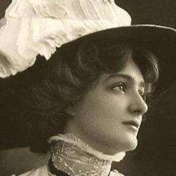
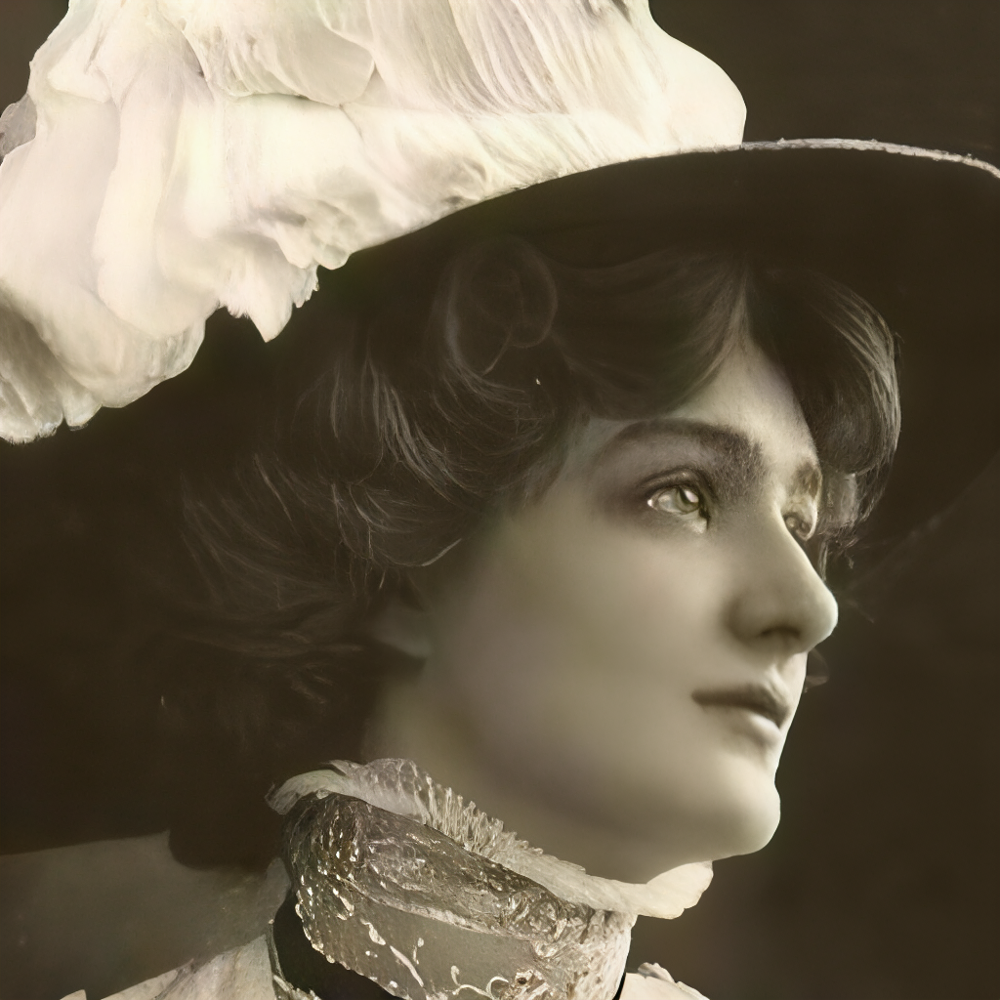
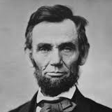
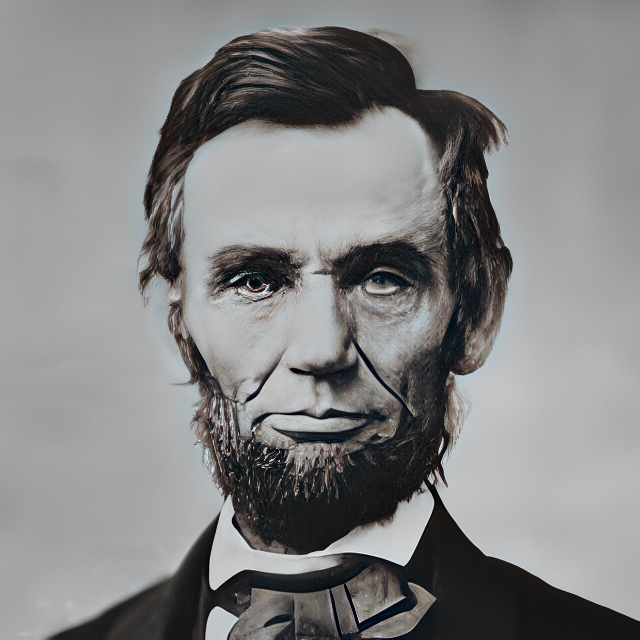
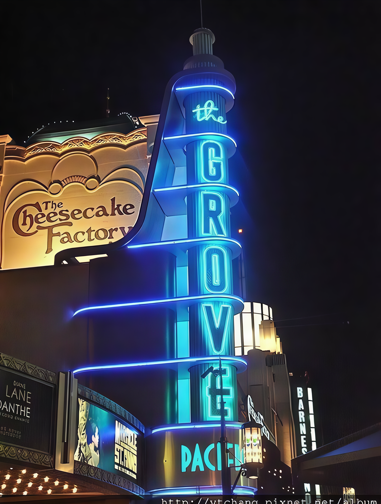
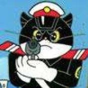
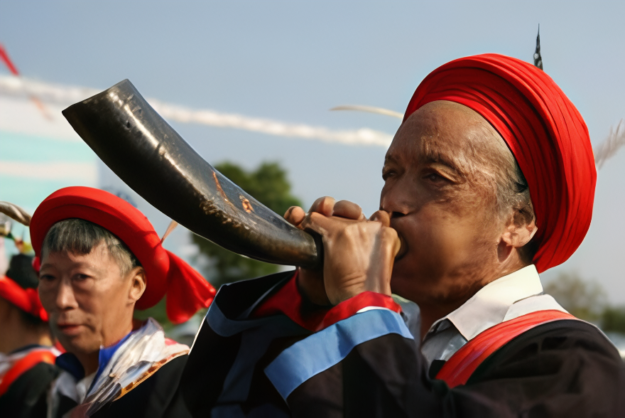
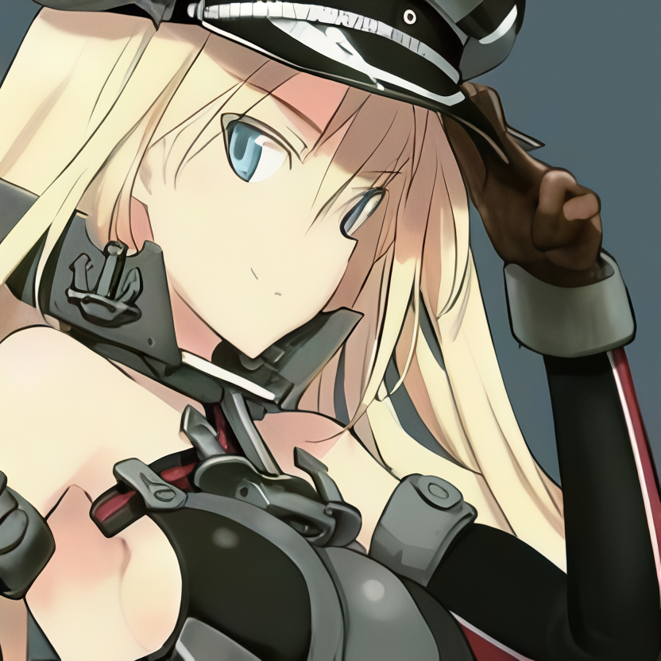

# LPNSR: Optimal Noise-Guided Diffusion Image Super-Resolution Via Learnable Noise Prediction

A diffusion-based image super-resolution method that learns to predict optimal noise maps for efficient sampling.

---

> Diffusion-based image super-resolution (SR) aims to reconstruct high-resolution (HR) images from low-resolution (LR) observations.
> However, the inherent randomness injected during the reverse diffusion process causes the performance of diffusion-based SR models to vary significantly across different sampling runs, particularly when the sampling trajectory is compressed into a limited number of steps.
  A critical yet underexplored question is: what is the optimal noise to inject at each intermediate diffusion step? In this paper, we establish a theoretical framework that derives the closed-form analytical solution for optimal intermediate noise in diffusion models from a maximum likelihood estimation perspective, revealing a consistent conditional dependence structure that generalizes across diffusion paradigms. 
  We instantiate this framework under the residual-shifting diffusion paradigm and accordingly design an LR-guided multi-input-aware noise predictor to replace random Gaussian noise.
  We further mitigate initialization bias with a high-quality pre-upsampling network. The compact 4-step trajectory uniquely enables end-to-end optimization of the entire reverse chain, which is computationally prohibitive for conventional long-trajectory diffusion models. Extensive experiments demonstrate that LPNSR achieves state-of-the-art perceptual performance on both synthetic and real-world datasets, without relying on any large-scale text-to-image priors.

📄 **Paper:** [arXiv:2603.21045](https://arxiv.org/abs/2603.21045)

---

## Visual Results

<div align="left">
  <b>4× Real-world Super-Resolution</b>
  <br><br>
  <table>
    <tr>
      <th>LQ Image</th>
      <th>SR Image</th>
    </tr>
    <tr>
      <td></td>
      <td></td>
    </tr>
    <tr>
      <td></td>
      <td></td>
    </tr>
    <tr>
      <td></td>
      <td></td>
    </tr>
    <tr>
      <td></td>
      <td></td>
    </tr>
    <tr>
      <td></td>
      <td></td>
    </tr>
    <tr>
      <td></td>
      <td></td>
    </tr>
  </table>
</div>

## Requirements

- Python 3.10.11, PyTorch 2.9.1+cu128, Xformers 0.0.33.post2
- A suitable conda environment named `lpnsr` can be created and activated with:

```bash
conda create -n lpnsr python=3.10.11
conda activate lpnsr

# Install PyTorch with CUDA support 
#CUDA 12.8
pip install torch==2.9.1 torchvision==0.24.1 --index-url https://download.pytorch.org/whl/cu128

# Install other dependencies
pip install -r requirements.txt

# Linux/headless environments: remove the GUI OpenCV wheel that may be
# installed transitively by basicsr/facexlib, then restore the headless wheel.
pip uninstall -y opencv-python
pip install --force-reinstall opencv-python-headless==4.12.0.88

# Install xformers for acceleration
pip install xformers==0.0.33.post2
```

## Pre-trained Models

Download all pre-trained models from [Hugging Face](https://huggingface.co/mirpri/LPNSR) or [腾讯微云](https://share.weiyun.com/2P35qGWJ) (password: `qdhijm`), and place them in the `pretrained/` folder (you can change the weights path in `configs/inference.yaml`) :

| Model                                                 | Description |
|-------------------------------------------------------|-------------|
| `autoencoder_vq_f4.pth`                               | VQGAN encoder/decoder (4x spatial compression) |
| `resshift_realsrx4_s4_v3.pth`                         | Pre-trained ResShift UNet |
| `noise_predictor_v2.pth`                              | Trained noise predictor |
| `noise_predictor_v3.safetensors`                      | Trained noise predictor (safetensors, used by `configs/inference.yaml`) |

All the required weights can now be found in the Release of this repository.
Note: The baseline noise_predictor.pth is the exact model checkpoint used for the experiments presented in the paper. The v2 version computes GAN loss in the latent space, and achieves better generation quality.


## Quick Start

### :rocket: Inference

```bash
python inference.py -i [image folder/image path] -o [output folder]
```

### :test_tube: Testing

```bash
python test.py --lq_folder [lq image folder] --gt_folder [gt image folder] --output_folder [output folder]
```

Computes PSNR (Y), SSIM (Y), LPIPS, DISTS, NIQE, MUSIQ, MANIQA and CLIPIQA per image, plus dataset-level FID when GT images are provided. Metrics are saved to `metrics.csv` / `metrics.json` together with the SR images in the output folder.

**Note:** If only LQ images are provided (without GT reference images), only no-reference metrics will be computed.

## Training

### :turtle: Preparing Stage

1. Create a folder named `traindata/` and put your training data in the `traindata/` folder (high-resolution images)
2. Download the pre-trained models (see above)
3. Adjust the configuration in `configs/trainer.yaml`

### :dolphin: Begin Training

```bash
python trainer.py
```

Training is iteration-based (`training.iterations`, default 200000 optimizer steps). The noise predictor can be warm-started from a pretrained checkpoint via `noise_predictor.pretrained_path` in `configs/trainer.yaml` (set it to `null` to train from scratch). Validation on `assets/validate_lq` / `assets/validate_gt` (PSNR, SSIM, LPIPS, DISTS, NIQE, MUSIQ, MANIQA, CLIPIQA) runs automatically every `save_freq` steps.

### :whale: Resume from Interruption

```bash
python trainer.py --resume experiments/noise_predictor/checkpoints/training_state_stepXXXXX.pth
```

## Reproducing the results in our paper
### :red_car: Prepare data
Download datasets used in our paper from [Hugging Face](https://huggingface.co/datasets/mirpri/LPNSR) or [腾讯微云](https://share.weiyun.com/2P35qGWJ) (password: `qdhijm`), and place them in the `testdata/` folder

### :rocket: Begin Testing
```bash
python test.py --lq_folder [lq image folder] --gt_folder [gt image folder]
```

## Acknowledgement

This project is based on:
- [ResShift](https://github.com/zsyOAOA/ResShift) - Efficient diffusion model for image SR
- [BasicSR](https://github.com/XPixelGroup/BasicSR) - Basic super-resolution toolbox
- [SwinIR](https://github.com/JingyunLiang/SwinIR) - Swin Transformer for image super-resolution
- [Real-ESRGAN](https://github.com/xinntao/Real-ESRGAN) - Degradation simulation

Thanks for these awesome works.

## License

This project is licensed under the MIT License.

## Contact

If you have any questions, please feel free to open an issue or contact the maintainer via `frozen2001@hust.edu.cn`.
